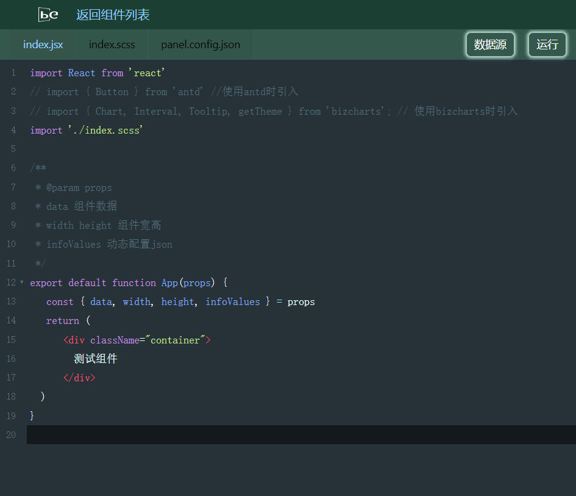
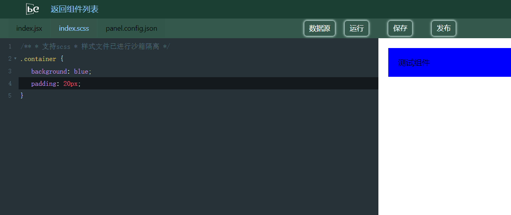
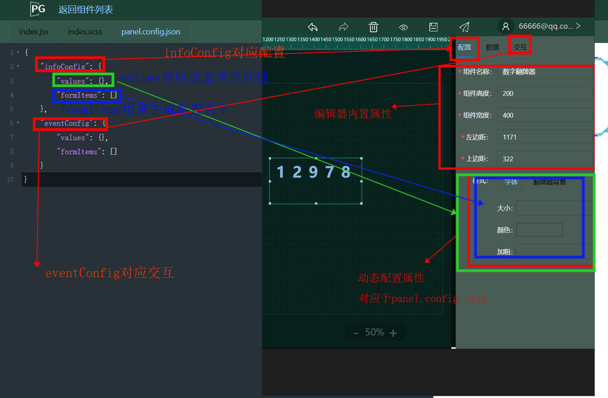
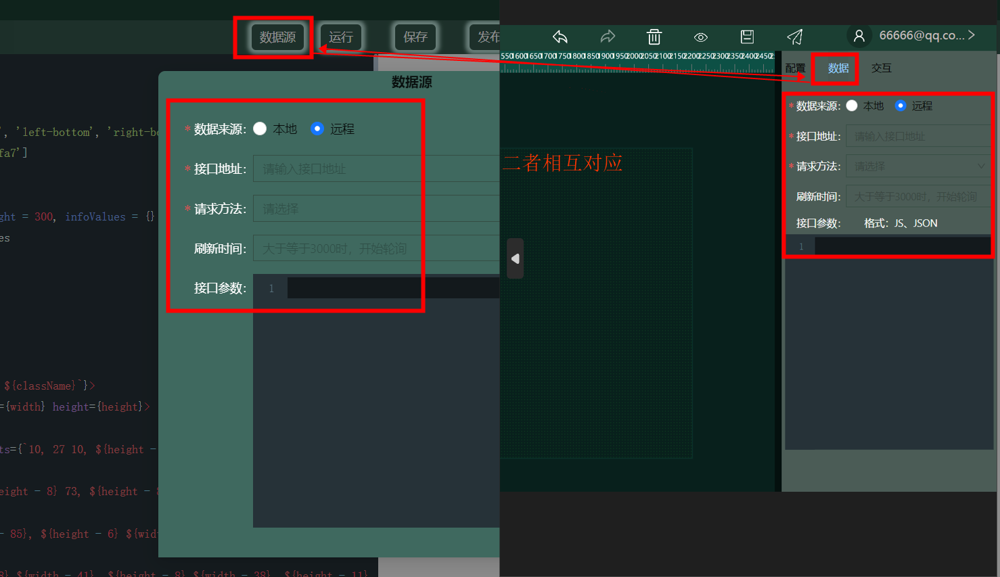
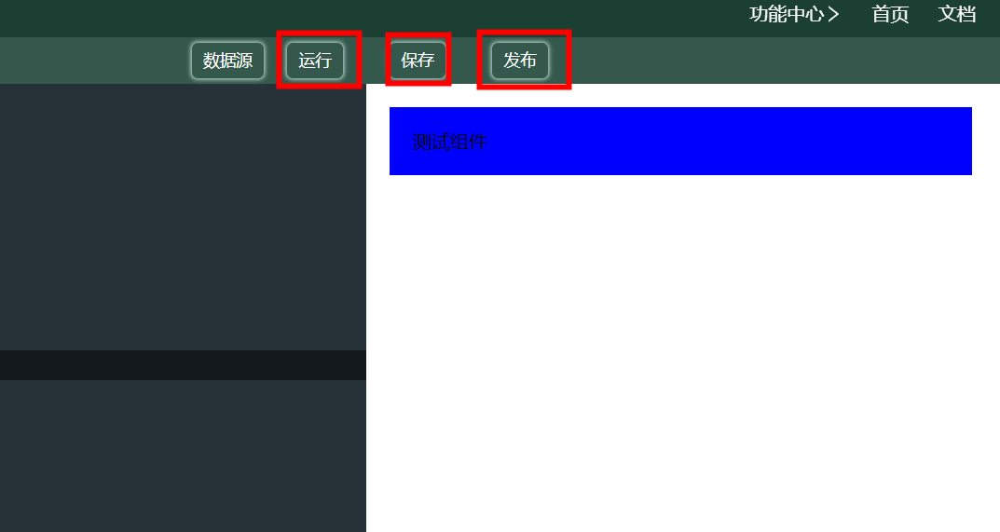

## 基础介绍

组件编辑器集成了开发环境，可以直接进行编码，即时预览。

目前已经开放的依赖有react, antd, axios, bizcharts, echarts, dataset，支持react hooks编码， class模式编码。

## 文件介绍

### index.jsx 

index.jsx 是组件代码，在开发时，要进行export default导出
使用样式文件需要引入
```js
import './index.scss'
```


### index.scss

index.scss是组件样式，支持scss，同时样式进行了沙箱隔离，不用担心样式冲突




### panel.config.json

panel.config.json是用来生成组件操作面板的配置文件，可以直接在这里编辑json，也可以去表单编辑器中生成json
panel.config.json结构介绍

panel.config.json

```json
{
  infoConfig: {    // 组件配置面板
    values: {}     // 配置面板表单的值
    formItems: []  // 配置面板表单结构json
  },
  eventConfig: {    // 组件交互面板
    values: {}     // 交互面板表单的值
    formItems: []  // 交互面板表单结构json
  },
}
```



**说明**

由于配置面板已经内置部分表单，infoConfig.formItems在配置时，不能使用以下字段：

```json
name    // 组件名称
width   // 组件宽度
height  // 组件高度
x       // 上边距
y       // 下边距
```

## 数据源介绍
数据源分为本地数据和远程数据，和大屏编辑器中的数据面板是对应的
本地数据可以写入json
远程数据提供两种方式，可以配置接口和参数。远程数据也可以在组件内使用axios请求，可自主选择



**说明**
修改过数据源字段后，需要点击应用才会生效

## 操作按钮介绍

线上环境提供了运行，保存，发布功能

修改过代码，样式或者配置后，点击运行即可编译预览\
线上环境提供了代码自动化检测，如果代码报错，会透出报错信息

保存按钮会将组件保存为草稿，方便下次编辑

发布按钮会将组件发布，此时状态会更新到审核中（目前用户可以直接发布）




