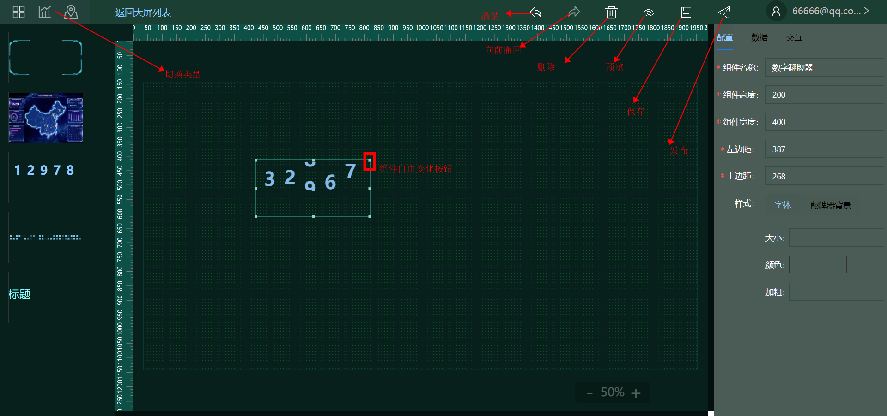
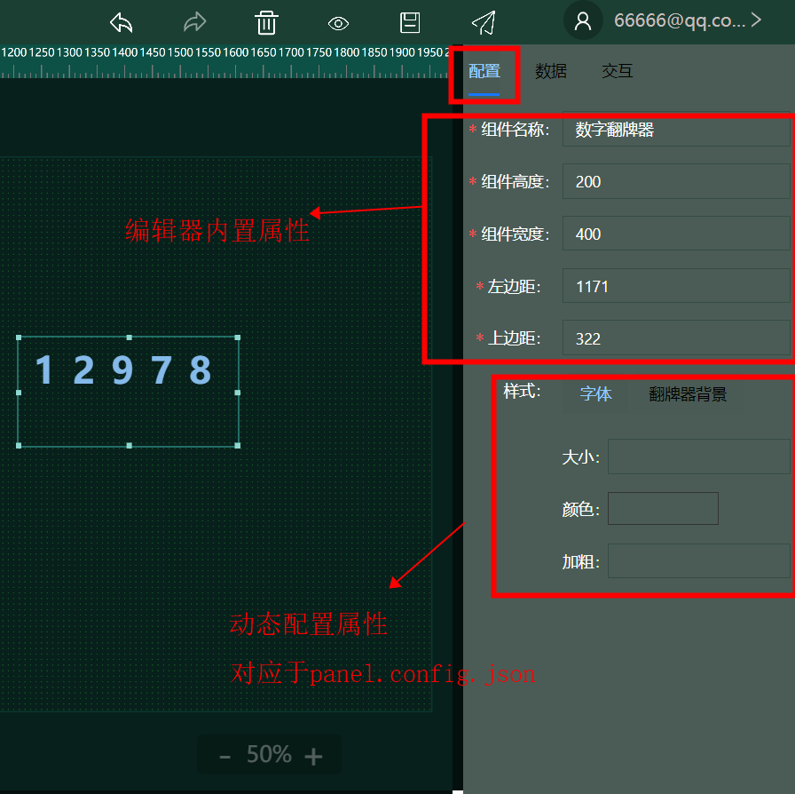
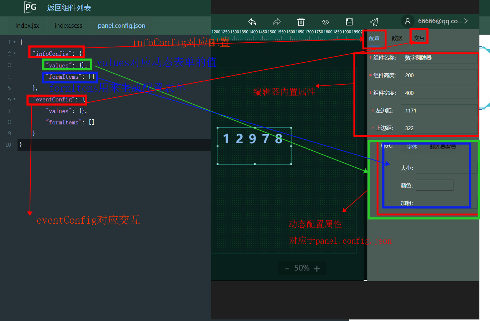
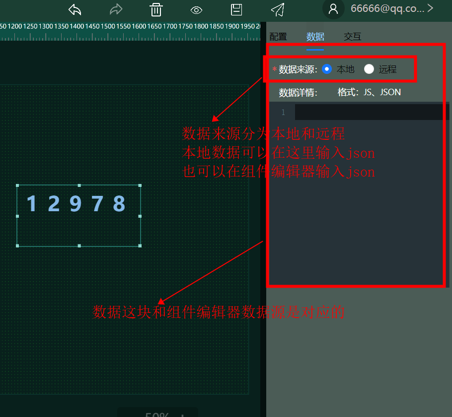
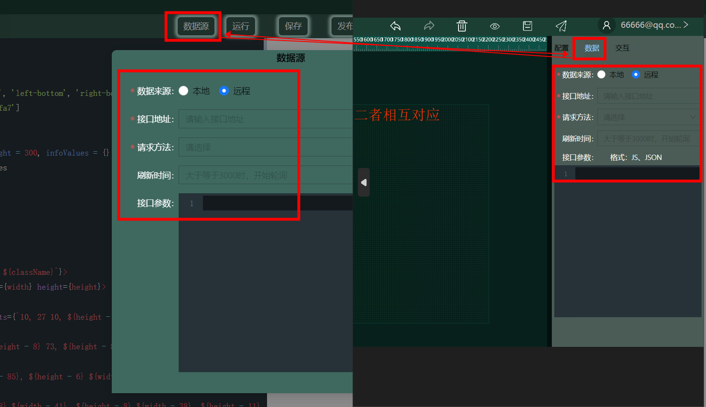
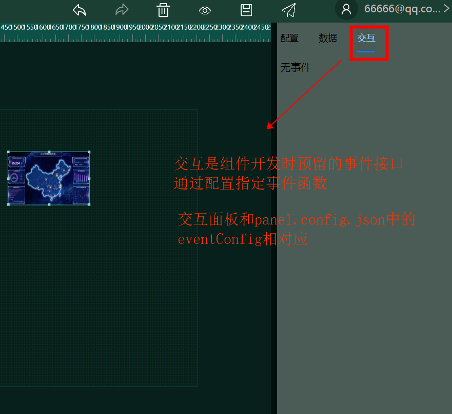

## 功能区域介绍

\

## 按钮介绍

\

## 组件属性区域介绍

### 1，组件配置区域
配置区域是组件开发时，预留的变量接口，配置操作面板是用来填写这些变量的入口\
组件配置和组件编辑器中的panel.config.json是对应的，panel配置可以查看组件编辑器介绍

\

大屏编辑器和组件编辑器对应关系\

\

### 2, 数据源介绍

数据配置支持远程和本地两种方式

\

数据面板和组件编辑器中的数据源是对应的

\

### 3，交互配置

交互是组件开发时预留的事件接口，通过panel.config.json中的eventConfig配置

eventConfig中的value对用事件的名称和值

eventConfig中的formItems用来生成交互面板表单

\

