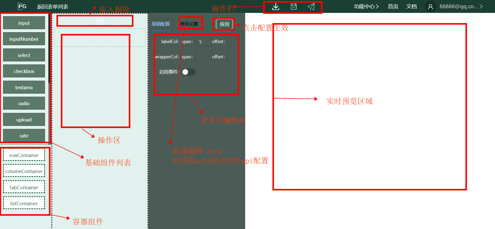

## 基础介绍

form编辑器提供在线表单设计，基于表单引擎formake研发，操控区和视图区分离，更有利于拖拽嵌套。

form编辑器支持多层嵌套，用户可以根据业务选择，表单设计后，可以保存到表单list，也可以下载json文件使用。

**说明**

listContainer列表容器不能嵌套列表容器

## 功能区域介绍




## 表单项配置介绍

1，表单项配置字段名称不可重复，formake是基于antd开发的，字段重复会被覆盖

2，rowContainer, columnContainer, tabContainer字段名称可以填写也可以不填写，\
如果填写，则其子表单的表单值会被收集到该字段

demo

```json
{
  "marktype": "columnContainer",
  "title": "columnContainer",
  "param": "style",
  "label": "样式",
  "items": [
    {
      "marktype": "inputNumber",
      "title": "inputNumber",
      "label": "大小",
      "disabled": false,
      "rules": [],
      "eventConfig": {
        "filter": [],
        "modify": []
      },
      "placeholder": "",
      "id": 1684571077997,
      "param": "fontSize"
    },
    {
      "marktype": "color",
      "title": "color",
      "param": "color",
      "label": "颜色",
      "disabled": false,
      "rules": [],
      "eventConfig": {
        "filter": [],
        "modify": []
      },
      "id": 1684571064671
    }
  ],
}
```
上面的配置，使用formake中 getFormateFieldsValue可以得到

```js
style: {
  fontSize: '14px',
  color: '#ffffff'
}
```

如果使用antd getFieldsValue得到的依旧是扁平化对象

## 高级设置介绍

由于表单配置属性较多，基础配置只是展示了比较常用的配置，编辑器额外提供了高级设置，高级设置可以直接编辑json，配置api可以参照antd中表单组件的api。

除了支持antd中的api，高级设置支持事件配置，即表单的联动。事件配置主要是编辑eventConfig属性，具体文档参见formake介绍。\
formake我们自主研发的一款开源表单引擎，事件配置是其独有的特性之一。

demo

```js
{
  marktype: 'radio',
  label: '是否远程',
  param: 'isOrigin',
  eventConfig: {
    filter: [
      {
        triggerValue: ['0'],
        hideFields: ['url', 'method', 'freshTime'],
      }
    ],
    modify: [

    ],
  }
}
```
上面的配置是指：当isOrigin字段值为<font color="#4c9aed">'0'</font>时，隐藏字段<font color="#4c9aed">['url', 'method', 'freshTime']</font>


